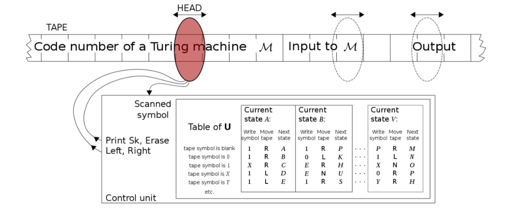
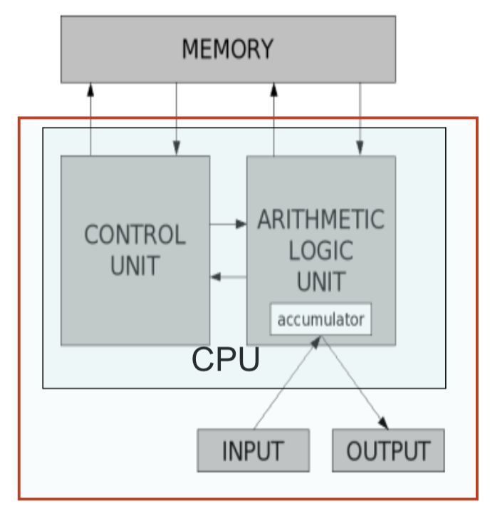
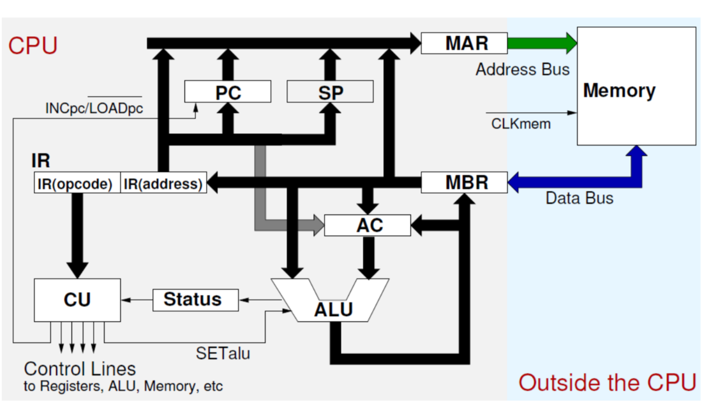
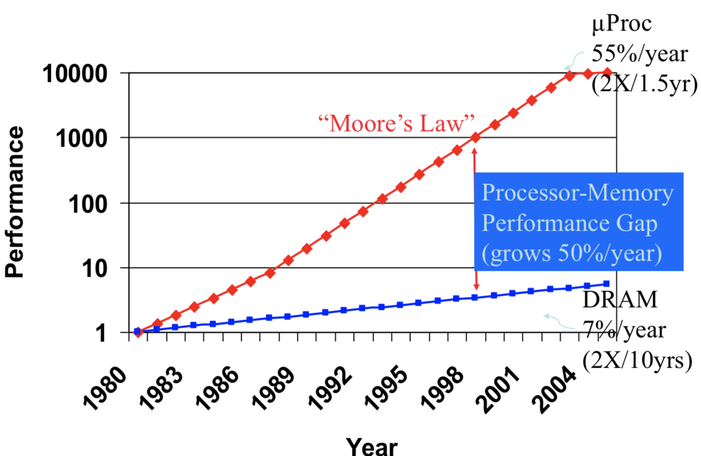
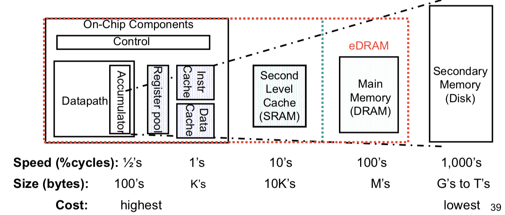
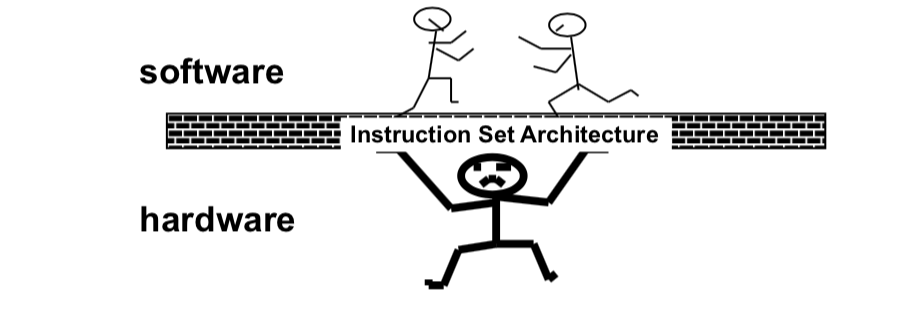
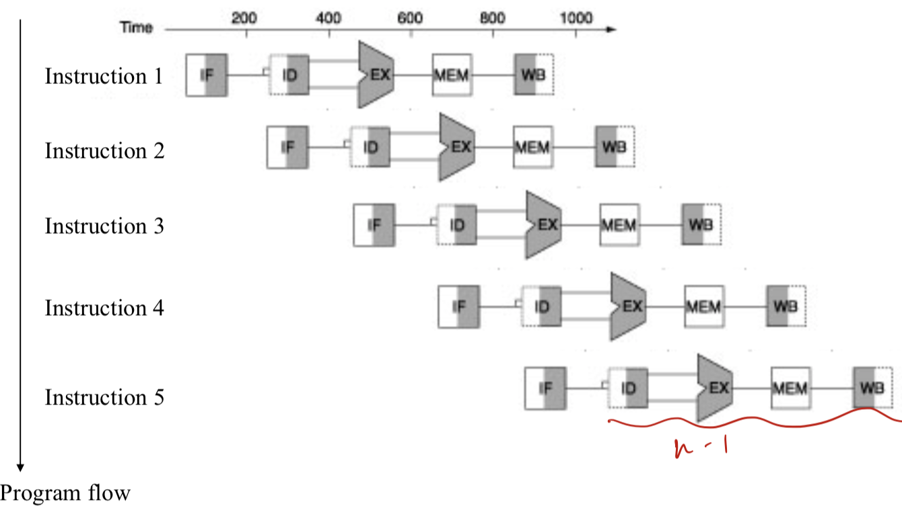
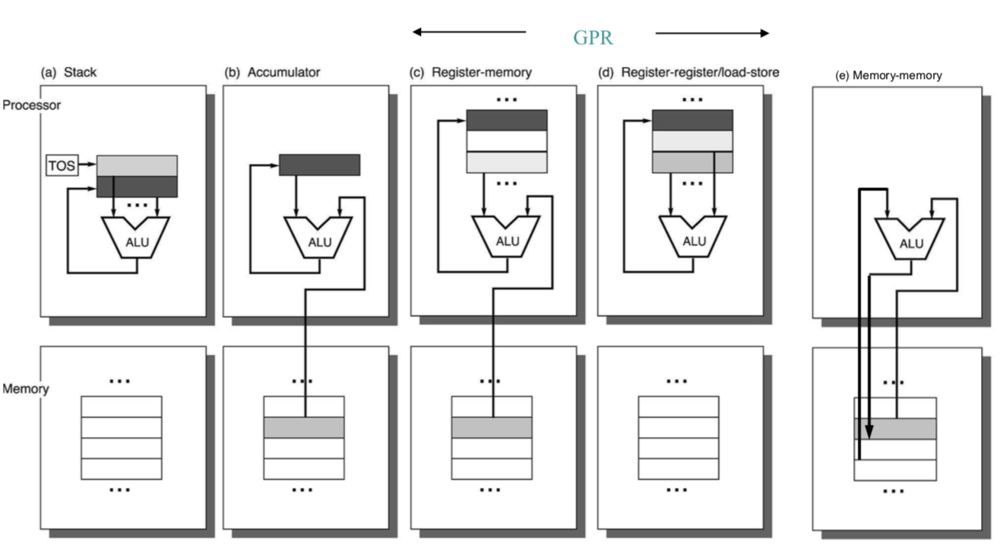
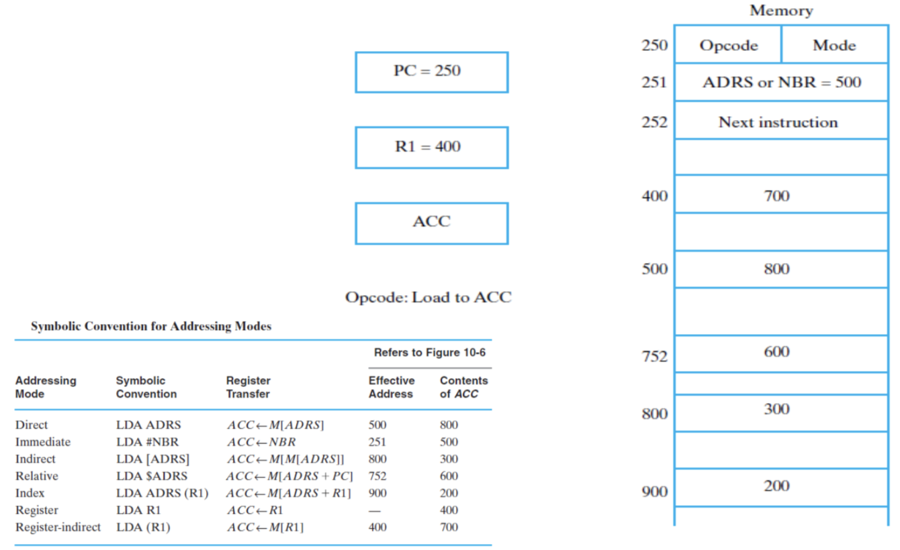

# Lecture 5 -- Computer Architecture Overview

## 5.1 Ideas

### 5.1.1 Universal Computing Device

All computers, given enough time and memory, are capapble of computing exactly the same things.


### 5.1.2 Turing Machine

Definition: Mathematical model of a device that can perform any computation

- Ability to read/write symbols on an infinite "tape"
- State transitions, based on current state and symbol

#### 5.1.2.1 A more formal definition from FSM prospective

- *Tape* that can store a finite set of alphabets (including bank)
- *Head* that can read and write symbols from/to the tape, and move right or left one cell at a time
- *State register* with a start state (and often accept state)
- *Finite table of instructions:* given current state and the symbol read pointed by the head, it either (1) write/erase a symbol, (2) move head, (3) do state transition




### 5.1.3 Universal Turing Machine

A machine that can implement all Turing machines -- this is also a Turing machine

- Inputs: data with a description of computation (other Turing machines)
- Instructions are part of the input data
- A computer can emulate a Universal Turing Machine
- U is programmable, so it is a computer

A computer is a universal computing device


### 5.1.4 Transformation Between Layers

```mermaid
graph TD
A(Problem)--Software design-->B(Algorithm)
B--Programming-->C(Program)
C--Compiling/Interpreting-->D(Instruction Set Architecture)
D--Processor Design-->E(Microarchitecture)
E--Logic/Circuit Design-->F(Circuits)
F--Process Engineering-->G(Devices)

```


## 5.2 Von Neumann Architecture

### 5.2.1 Key Features

- Five Components
  - Central Arithmatic Part (CA)
  - Central Control Unit (CC)
  - Memory (M)
  - Input (I)
  - Output (O)
- Use binary instead of decimal system
- Single storage structure hold both instructions and data in binary form
- Computer can fetch instructions and execute them automatically



### 5.2.2 Abstract Model of Computer Components

#### 5.2.2.1 CPU and Memory

- CPU: The control unit, ALU, and some registers
- Main memory: stores instructions as well as data

Registers

- MAR: The Memory Address Register is used to store the address to access memory
- MBR: The Memory Buffer Register stores information that is being sent to, or received from, the memory along bidirectional data bus
- AC: The accumulator is used to store data that is being worked on by ALU and is the key register in the data section of the cpu. Notice that the memory cannot access the AC directly. The MBR is an intermediary
- PC: Connected to the internal address bus, the Program Counter holds the address in memory of the next program instruction. Notice it doesn't directly connect to the memory, but must go via the MAR. (It is both a register and a counter)
- IR: When memory is read, the data first goes to the MBR. If the data is an instruction it gets moved to the Instruction Register.
  - IR (opcode): Most significant bits of the instruction. Contains the real instruction.
  - IR (address): The least significant bits of the instruction are actually data. They form all or part of an address for later use in the MAR.
  - SP: The stack pointer is connected to the internal address bus and is used to hold the address of a special chunk of main memory used for temporary storage during program execution.



#### 5.2.2.2 Instruction Cycle in the CPU: Fetch and Execute

Each instruction in an assembly-language program goes through two states in an instruction cycle

- Fetch:
  - PC holds the address of the next instruction to fetch
  - CPU fetches instruction from memory location pointed to by PC
  - Increment PC unless told otherwise by branch or loop instructions
  - Instuction loaded into IR
  - Processor interprets instruction and performs required actions
- Execute:
  - Data transfer (load/store)
  - Data processing (add/sub)
  - Control flow


## 5.3 Instruction Set Architecture

In Lecture 6 notes.


## 5.4 Processor-Memory Performance Gap



### 5.4.1 Memory Hierarchy

- Large memories are slow (cheap) and fast memories are small (expensive)
- Create illusion of a memory that is large, cheap and fast by exploiting memory hierarchy and priciple of locality



Cache: A small amount of fast memory hardware component located physically near to the CPU and serves as a "middle-man" in the data exchange between CPU and main memory.

When requesting contents from main memory, CPU first looks for the content in the cache and if content is present, retrieves it from the cache. Otherwise, the CPU accesses the main memory directly to fetch the content which is also placed on the cache.


# Lecture 6 -- Instruction Set Architecture

A very important abstraction

- Interface between hardware and low-level software
- Standardizes instructions, machine language bit patterns
- Allows different implementations of the same architecture
- Sometimes prevents adding new innovations



## 6.1 RISC vs. CISC

CISC: Complex Instruction Set Computer

- Intel X86: variable length instructions, lots of addressing modes, lots of instructions, recent X86 decodes instructions to RISC-like micro-operations

RISC: Reduced Instruction Set Computer

- MIPS, Sun SPARC, IBM, PowerPC, ARM, RISC-V
- Fixed instruction length, uniform instruction formats, load-store instruction sets, limited number of addressing modes, limited number of operations

| CISC                                                         | RISC                                                         |
| ------------------------------------------------------------ | ------------------------------------------------------------ |
| large number of instructions and many addressing modes       | one instruction per cycle, a simple instruction set with a few modes |
| slower clock rate                                            | fast clock rate                                              |
| complex control unit, thus requiring microprogrammed implementation | hardwired control unit                                       |
| more difficult to pipeline                                   | more efficient pipelining                                    |
| complex programs require fewer instructions in CISC          | RISC requires a large number of instructions to accomplish the same task |


## 6.2 Pipelining

A pipeline is a set of data processing elements connected in series, where the output of one element is the input of the next one. The elements of a pipeline are often executed in parrallel when viewed in a time-sliced fashion. More number of stages in the pipeline enhances parallelism and speeds up computation.

The execution of an instruction cycle can be divided into several stages:

- Fetch Instruction
- Decode Instruction
- Execute Instruction
- Memory Operation
- Write Back result to registers/memories




### 6.2.1 Efficiency Analysis

Suppose one clock cycle lasts $\tau$ seconds. A single instruction is issued every clock cycle. Assume an instruction pipeline with $K$ stages and each stage lasts a duration of one clock cycle. A program has $n$ instructions independent of one another. Let's calculate the time consumed for completing all instructions.

$T_{without-pipeline}=nK\tau$

$T_{pipeline}=K\tau +(n-1)\tau$

$\text{speed up ratio}={{nK\tau}\over{K\tau +(n-1)\tau}}\stackrel{n\rightarrow \infty}{=}K$


### 6.2.2 Pipeline Hazards

- Control hazards: dependency in the execution outcome of a previous instruction leads to uncertainty on what the next correct instruction should be
- Data hazards: dependency on shared data used by a previous instruction still in pipeline

To resolve hazards,  we can insert no-operation (nop) instruction between instructions that have dependencies. Compiler software automates the task of inserting nop in program to resolve hazards


## 6.3 Classification of ISAs



### 6.3.1 General Purpose Registers

Reasons of using GPRs?

1. Registers are much faster than memory (even cache)
2. Registers are convenient for variable storage. Compiler assigns some variables just to registers
3. More compact code since small fields specify registers


Disadvantages:

- Need to save and restore on procedure calls and context switch
- Cannot take the address of a register (for pointers)
- Fixed size
- Compiler must manage
- Limited number


### 6.3.2 Stack

0-address

```pseudocode
add:
tos = tos + next
```

Example of computing `A*B-(A+C*B)`

```pseudocode
push A
push B
mul
push A
push C
push B
mul
add
sub
```


### 6.3.3 Accumulator

1-address

```pseudocode
add A:
acc = acc + mem[A]
```

Example of computing  `A*B-(A+C*B)`

```
load B
mul C
add A
store D
load A
mul B
sub D
```


### 6.3.4 Memory-Memory

May be 2 or 3-address

```pseudocode
add A, B:
mem[A] = mem[A] + mem[B]
add A, B, C:
mem[A] = mem[B] + mem[C]
```

Example of computing `A*B-(A+C*B)`

```pseudocode
// 3 operands
mul D, A, B
mul E, C, B
add E, A, E
sub E, D, E

// 2 operands
mov D, A
mul D, B
mov E, C
mul E, B
add E, A
sub D, E
```


### 6.3.5 Register-Memory 

2-address

```pseudocode
add R1, A:
R1 = R1 + mem[A]
store R1, A:
R1 = mem[A]
```

Example of computing `A*B-(A+C*B)`:

```pseudocode
load R1, A
mul R1, B
store R1, D
load R2, C
mul R2, B
add R2, A
sub R2, D
```


### 6.3.6 Register-Register/Load-Store

3-address

```pseudocode
load R1, R2:
R1 = mem[R2]
add R1, R2, R3:
R1 = R1 + R2 + R3
store R1, R2:
mem[R1] = R2
```

Example of computing `A*B-(A+C*B)`

```pseudocode
load R1, &A
load R2, &B
load R3, &C
mul R7, R3, R2
add R8, R7, R1
mul R9, R1, R2
sub R10, R9, R8
```


## 6.4 Addressing Mode

Define how machine language instructions identify the operands of each instruction. The rule for interpreting the address field of an instruction.

### 6.4.1 Immediate Mode

- Operand value is encoded directly in instruction
- Number of operands depends on operation (arithmetic or logical)
- Execution is in CPU and no need to fetch data from main memory
- Fast but very limited in computation
- e.g. `add 5`
  - The number 5 is the operand value of the instruction
  - Add the numerical value 5 to the contents of the accumulator

$Operand=value$


### 6.4.2 Direct Addressing Mode

- To access the content at a particular memory address in main memory, memory address field value is encoded directly in the instruction.

- Single main memory reference to access data
- Address space is limited by the size of main memory
- e.g. `add 0x0004`
  - Add contents at memory address A to accumulator
  - Look in memory at address A for the operand value

$EA=operand$


### 6.4.3 Register and Register-Indirect Mode

- Register mode: The address field specifies a processor register
  - `add R1, R2`
  - $EA=R_{i}$
- Register-indirect mode: The address field specifies a register in the processor whose content gives the address of the operand in the memory. Fewer bits are used compared with direct addressing mode
  - $EA=m[R_i]$


### 6.4.4 Indirect Addressing Mode

- Indirect addressing mode: the address field of the instruction gives the address at which the effective address is stored in memory.
  - $EA=[[operand]]$


### 6.4.5 Relative Addressing Mode

- $EA=[operand+PC]$
- offset often stored in PC register


### 6.4.6 Indexed Addressing Mode

- The content of an indexed register is added to the address part of the instruction to obtain the effective  address
- $EA=X+[R_i]$




