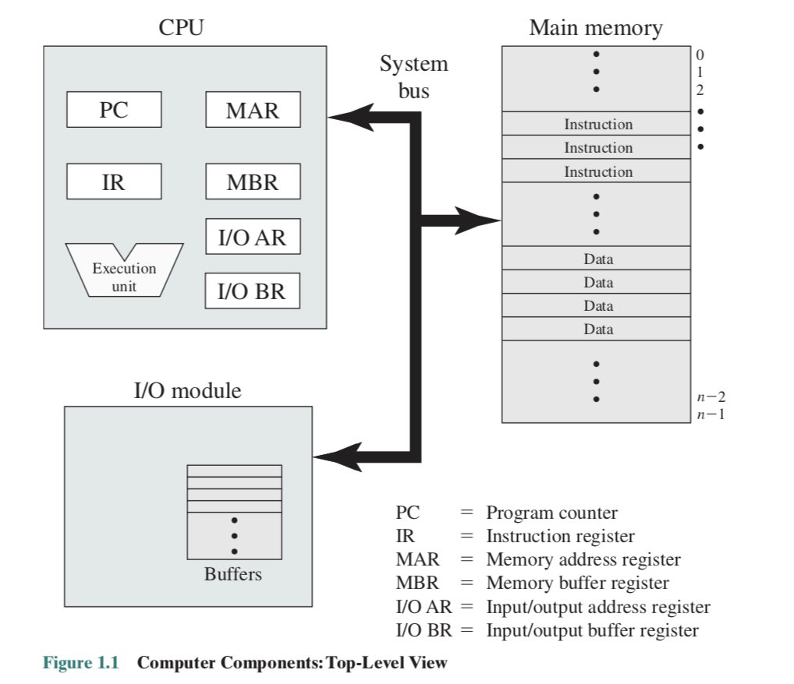
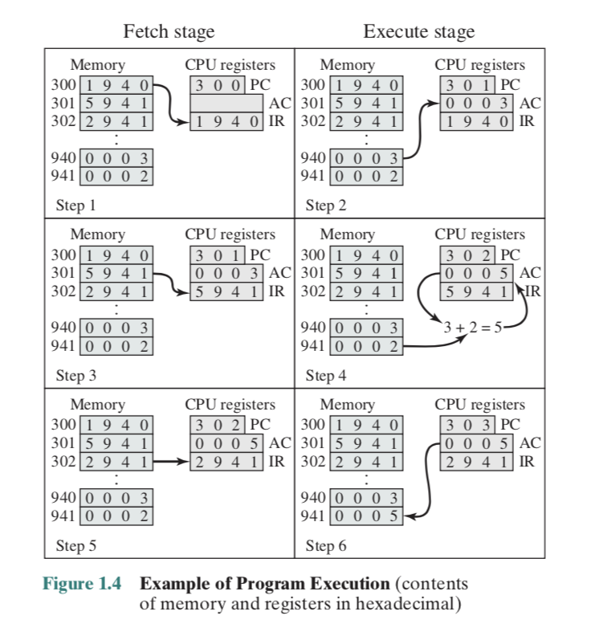
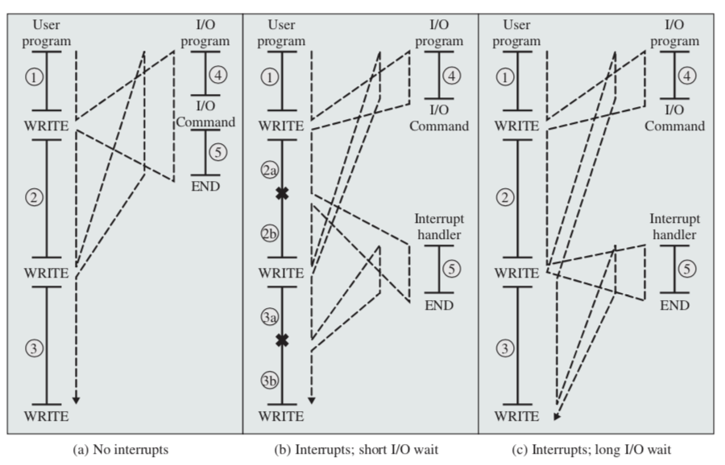
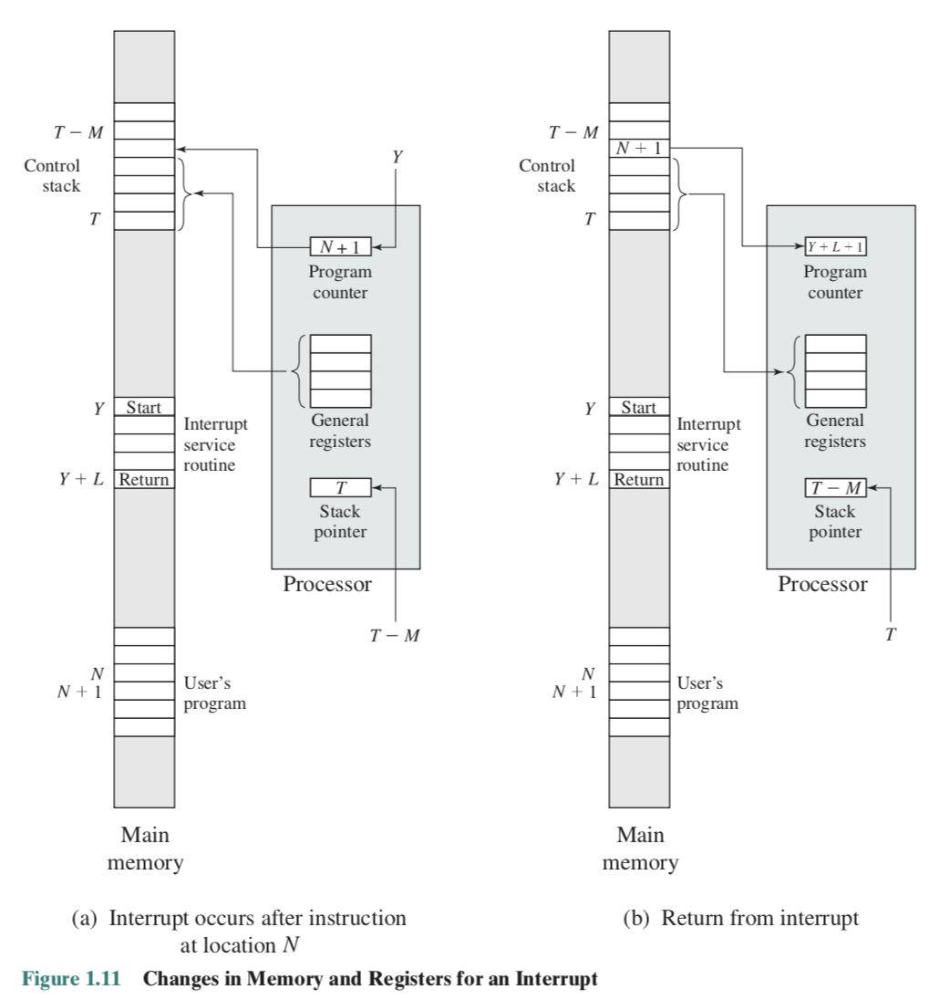
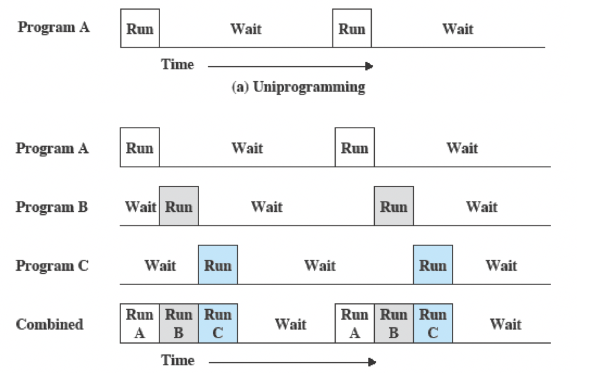
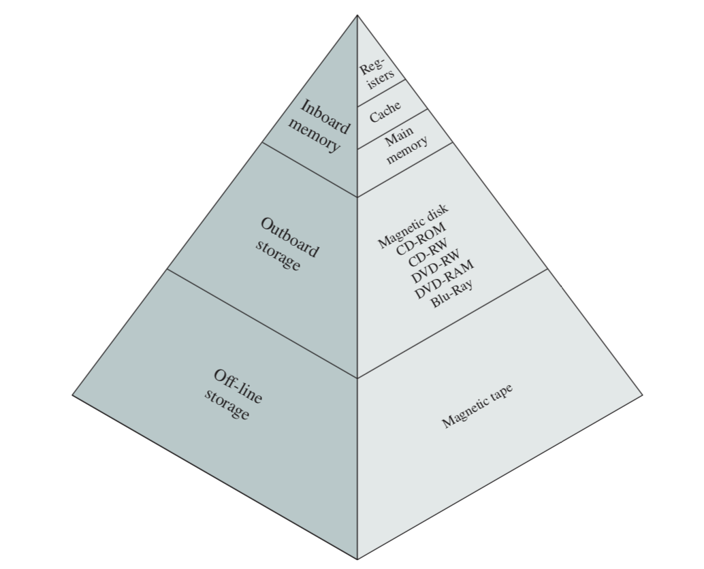

# 1 Lecture 1 -- Computer System & OS Overview

Based on Chapter 1 and 2 in textbook.

## 1.1 Basic Elements

The basic elements are processor, main memory, I/O modules and system bus.

### 1.1.1 Processor

- Referred to as the Central Processing Unit (CPU).
- Two internal components:
  - Control Unit
  - Arithmetic & Logic Unit (ALU)
- Controls operation and performs data processing
- Works repeatedly and continuounsly in cycles to execute instructions

### 1.1.2 Main Memory

- Referred to as primary memory or simply RAM.
- Consists of a set of locations defined by sequentially numbered addresses
- Stores data and programs
- Volatile
  - Contents of the memory is lost when the computer is shut down

### 1.1.3 I/O Modules

- **Moves data** between the computer and the external environment such as:
  - Storage (e.g. hard drive)
  - Communication equipment
  - Terminals

### 1.1.4 System Bus

- Provides for communications among processors, main memory and I/O modules

## 1.2 Instruction Execution

- A program consists of a set of instructions stored in main memory.

- 4 steps in a machine cycle

  - Processor reads (fetches) an instruction from memory
  - Processor interprets (decodes) the current instruction
  - Processor executes the instruction
  - Processor stores the result back to memory

- Registers: special memory locations inside the processor that can be accessed very fast

  - Program Counter (PC) holds address of the instruction to be fetched next. PC is incremented after each fetch.
  - Fetched instruction loaded into Instruction Register (IR).
  - Execution result stored in Accumulator (AC) temporarily.
  - Program Status Word (PSW) contains execution status information. (Flags in Assembly Language)

- Each instruction contains bits (opcode) specifying whtat action the CPU needs to take

  - Processor-memory
  - processor-IO
  - data processing
  - Contol

  

Consider the example above, the first digit in an instruction is the opcode (4 bits, 16 operations).

- 0001: Load AC from memory
- 0010: Store AC to memory
- 0101: Add memory to AC

## 1.3 Interrupts

An interrupt means other modules could interrupt the normal sequencing of the processor.

Interrupts are provided to improve processor utilization. Since most peripheral modules are slower than the processor, if the processor pauses to wait for device, there will be a wasteful use of it.

Consider the following example showing the difference between no interruption, short I/O wait and long I/O wait.

Case 1: No interrupts. When the technique is not used, the processor has to wait for the whole I/O operation to be completed. As the I/O operation takes time longer than the processor in million times order, it wastes the use of the processor a lot.

Case 2: Interrupts with shor I/O wait. The processor will proceed to the next operation while letting the I/O module execute the order itself. In this case, the I/O command will finish before the processor completes the next instruction. Therefore, it issues an interruption to let processor deal with the I/O operations, which takes only a short period of time.

Case 3: As in case 2, the processor lets the I/O module execute the I/O command. However, after it completes the next instruction, it may needs to wait for the I/O module to finish the command.

To process the interrupt, the processor needs to find the way to store the current processing states (PC, PSW, and values in other registers). Program stack is used.

## 1.4 Uniprogramming and Multiprogramming

- Uniprogramming: only one program is running at a given time.

  The processor spends a certain amount of time executing. until it reaches an I/O instruction. It must then wait until that I/O instruction conclues before proceeding.

- Multiprogramming: processor has more than one program to execute.

  When one job needs to wait for I/O, the processor can switch to the other job.

(More notes about how it is different from multiprocessing will be added later on)

With uniprogramming, there is gross underutilisation of all resources. The improvement of average resource utilisation, throughput and response times is evident if multiprogramming is used.

### 1.4.1 Difference Between Terminologies

- A multiprogramming system runs more than one program "simultaneously" on one processor. The system attempts to keep several **programs** resident in main memory and **switches the processor rapidly between them**. Multiprogramming was developed to improve processor I/O and resource utilization.
- A multiprocessor is a computer system with **more than one processor**. Multiprocessing was developed in an effort to increase processing speeds by allowing truly parallel computation.

## 1.5 The Memory Hierarchy

The memory hierarchy is designed to meet the constraints on a computer's memory. That is, how much?, how fast?, ane how expensive?

Going from top to down along the hierarchy, we shall observe

- Decreasing cost per bit
- Increasing capcity
- Increasing access time 
- Decreasing frequency of access to the memory by the processor

### 1.5.1 Cache Memory

We know that the processor must access memory at least once per instruction cycle. Thus processor execution is limited by memory cycle time. buy processor speed is much faster than memory access speed.

The solution to this performance gap could be copying information in use from slower to faster (but smaller) storage temporarily. The storage is exactly cache.

Cache is checked first to determine if information is there.

- If it is, information is used directly from the cache.
- If not, data is copied to cache and used there.

Note that if the *hit ratio* is low, the time penalty for an idle cache access will make this design even more inefficient than the design without cache memory.

By analysing a simple two-level memory, we shall find that the relationship is linear.

#### 1.5.1.1 Principle of Locality

Data which is required soon is often close to the current data. If data is accessed, then it's neighbors might also be accessed in the near future.

**Spatial locality** refers to the tendency of execution to involve a number of memory locations that are clustered while **temporal locality** refers to the tendency for a processor to access memory locations that have been used recently.

### 1.5.2 Secondary Memory

Secondary Memories are also known as storage devices

- Extension of main meory that provides large non-volatile storage capacity
- Used to store program and data files
- Most commonly used: magnetic disks
  - Disk surface is logically divided into tracks, which are subdivided into sectors
  - The disk controller determines the logical interaction between the device and the computer

## 1.6 I/O Communication Techniques

When the processor encounters an instruction related to I/O, it executes that instruction by using a command to the appropriate I/O module. There are three techniques possible for I/O operations:

- Programmed I/O
- Interrupt-driven I/O
- Direct memory access (DMA)

### 1.6.1 Programmed I/O

- CPU issues a read command to I/O module to read a word of data from an external device into memory.
- I/O module performs the requested action
  - then sets the appropriate bits in the I/O status register (but takes no further action to alert CPU)
- CPU periodically checks the status of I/O module until it determines the instruction is completed.
- The performance is poor.

### 1.6.2 Interrupt-Driven I/O

- CPU issues a read command to I/O module and then goes on to do some other useful work
- I/O module will then interrupt CPU to request service when it is ready to exchange data with CPU.
- CPU executes the data transfer and then resumes its former processing
- More efficient than programmed I/O because there is no needless waiting. However, interrupt-driven I/O requires active intervention of CPU to perform data transfer

### 1.6.3 Direct Memory Access

- Performed by a seperate module.
- When CPU wishes to read/write, it issues a command to DMA module containing
  - Whether a read or write is requested
  - The address of the I/O device involved
  - The starting location in memory to read/write
  - The number of words to be read/written
- DMA module transfers the entire block of data directly to and from memory without going through CPU.
- More efficient than interrupt-driven I/O

## 1.7 Operating System Objectives & Functions

OS is a program that controls the execution of application programs. It acts as an interface between applications and hardware.

Main objectives:

- *Convenience*: making a computer more convenient to use
- *Efficiency*: allowing computer resources to be used efficiently
- *Ability to involve*: permitting effective development, testing and introduction of new system functions such as hardware upgrade, new hardware, new services, and fixes.

### 1.7.1 OS as a User/Computer Interface

- End user views a computer system in terms of a set of applications and is not concerned with the details of computer hardware.

- Programme makes use of a set of system programs (utilities) in developing an application and a running application invokes the utilities to perform certain functions
- The most important collection of system programs comprises the OS.

### 1.7.2 OS Services

- Program development

  OS provides a variety of facilities and services, such as editors and debuggers, to assist the programmer in creating programs.

- Program execution

  OS handles steps need to be performed to execute a program.

- Access I/O devices

  OS provides a uniform interface so that programmers can access I/O devices using simple reads and writes.

- Controlled access to files

  In the case of a system with multiple users, OS provides protection mechanisms to control access to the files

- System access

  For shared or public systems, OS controls access to the system as a whole and to specific system resources in order to provide protection of resources and data from unauthorized users and resolve conflicts for resource contention.

- Error detection and response

  A variety of errors can occur while a computer system is running. OS must provide a response that clears the error condition with the least impact on running applications.

- Accounting

  A good OS will collect usage statistics for various resources and monitor performance parameters such as response time.

### 1.7.3 OS as Resource Manager

- A computer is a set of resources for the movement, storage, and processing of data
- The OS is responsible for managing these resources
  - determines how much processor time is to be devoted to the execution of a particular user program
  - controls the allocation of main memory
  - decides when an I/O device can be used by a program in execution
  - controls access to and use of files

# 2 Lecture 2 -- Process Desctiption and Control

## 2.1 How are processes represented and controlled by the OS?

### 2.1.1 The Concept of Process

All modern OS rely on a model in which the execution of an application corresponds to the existence of one or more processes.

Process:

- A program in execution
- An instance of a program running on a computer
- The entity that can be assigned to and executed on a processor
- A unit of activity characterised by the execution of a sequence of instructions, a current state, and an associated set of system resources

A process is comprised of:

- Program code
- Associated data needed by the program
- Execution context of the program. containing all information the OS needs to manage the process

### 2.1.2 Requirements of an OS

- Fundamental task: **process management**
- The operating system must:
  - Interleave the execution of multiple processes
  - Allocate resources to processes and protect the resources of each process from other processes
  - Enable processes to share and exchange information
  - Enable synchronisation among processes

Example: Interleaved Execution of Processes

Omitted. See lecture notes and the textbook.

## 2.2 Process States

### 2.2.1 Two-State Process Model

- OS creates a new process and enters it into the system
- Process may be in one of two states
  - Running
  - Not running

- Processes that are not running are kept in some sort of queue, waiting for their turn to execute. Processes moved by the dispatcher of the OS to the CPU then back to the queue until the task is completed.

### 2.2.2 Five-State Process Model

While some processes in the Not Running state are ready to execute, others may be blocked (e.g., waiting for an I/O operation to complete)

- Running: The process that is currently being executed.
- Ready: A process that is prepared to execute when given the opportunity
- New: A process that has just been created but has not yet been admitted to the pool of executable processes by the OS. Typically, a new process has not yet been loaded into main memory, although its process control block has been created.

- Blocked: A process that cannot execute until some event occurs, such as the completion of an I/O operation
- Exit: A process that has been released from the pool of executable processes by the OS, either because it halted or because it aborted for some reason.

We can either use two queues - one `READY_QUEUE` and another `BLOCKED QUEUE`, or use multiple blocked queues, which seperates the events of blocking.