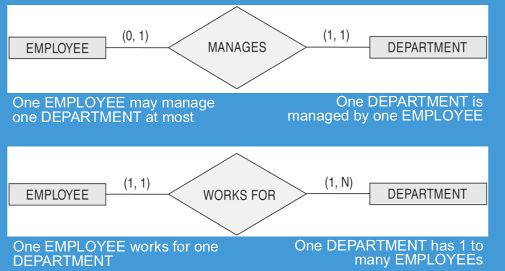
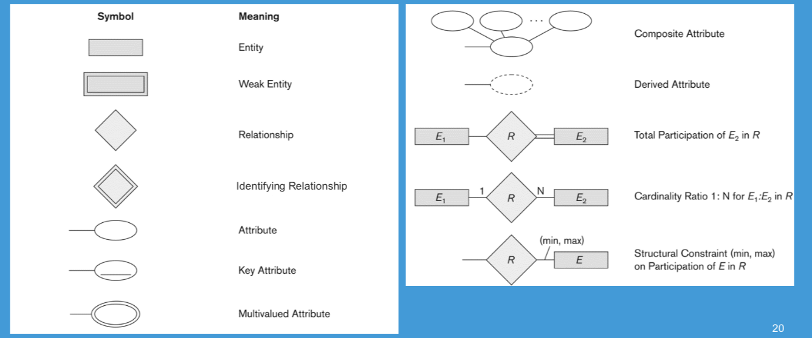
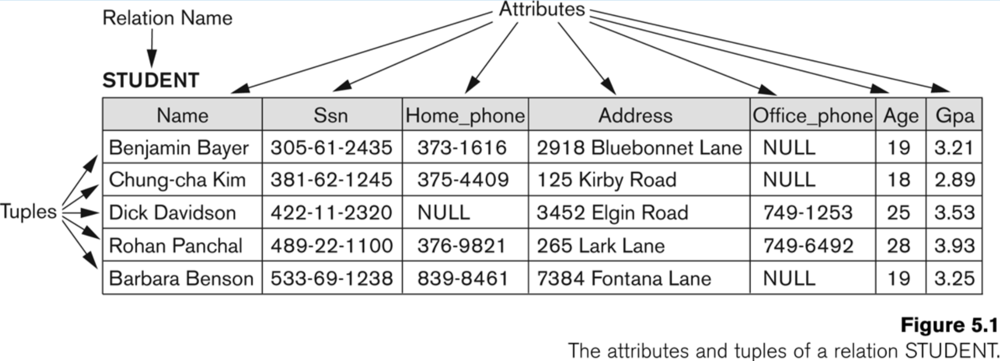

# 1. Lecture 1: Entity-Relationship (ER) Models

## 1.1 Concepts of ER Model

An Entity-Relationship model (ER Model) describes iterrelated things of interest in a specific domain of knowledge.

- A basic ER model is composed of **entity types** (employee/department) and specifies **relationships** that can exist between entities (instances of those entity types).
- An ER model is commonly formed to represent things that a business needs to remember in order to perform business processes.
- Consequently, the ER model becomes an abstract data model, that defines a data or information structure which can be **implemented in a database**, typically a relational database.

## 1.2 Entity, Entity Type and Entity Set

1. Entity: Defined as a thing capable of an independent existence that can be uniquely identified and exists either *physically or logically*.Entities can be thought of as nouns. In relational databases, an entity refers to a single tuple.

   Example: a person exists physically while an order transaction exists logically.

2. Entity type: **defines** a collection of entities that have the same attributes.

3. Entity sets: a set of entities of the same type. In relational databases, an entity set refers to the tuples represented in the same table.

Type is a definition while set is a collection.

## 1.3 Relationship, Relationship Type and Relationship Set

1. Relationship: captures how entities are related to one another. Relationships can be thought of as verbs,  linking two or more nouns.

   Example: a `work_for` relationship between an employee and a department.

2. Relationship type: defines a relationship among entities of certain entity types. Relationship types are useful for capturing or expressing certain business rules.

3. The degree of a relationship type is the number of participating entity types. A binary relationship is a relationship type involving two entity types (degree=2). Ternary (degree=3).

4. Relationship set: a collection of relationships all belonging to one relationship type represented in the database.

   Example: if a relationship type is registration, each enrolment of a student in a course is an instance of registration and appears in the relationship set.

   

## 1.4 Attributes

Both entities and relationships can have attributes. For example, an employee has a Social Security Number (SSN) attribute, while a `work_for` relationship has a start date attribute.

A key attribute is a set of attributes (one or more) that uniquely identify an entity. i.e., no two entities may agree in their values for all of the attributes that constitute a key. For example, SSN is a single key attribute for employees. University ID and student ID are composite attributes to identify a university student in a country because student IDs may not be unique among universities in a country.

### 1.4.1 Types of Attributes

- **A simple attribute** has a single atomic value that does not contain any smaller meaningful components. For example, SSN and gender.

- **A composite attribute** is composed of several components. For example, address contains flat, block, street, city and country. Composition may form a hierarchy where some components are themselves composite.

  

- **A multi-valued attribute** has multiple values. For example, color of a product (red and white) and major of a student (computer science and mathematics).

- Ingeneral, composite and multi-valued attributes may be nested to any number of levels although this is rare. For example, a person can have multiple postal addresses.
- **A derived attribute** is an attribute whose value is calculated from other values. It does not need to be physically stored within the database. Instead, it can be derived by using an algorithm.

### 1.4.2 Value Sets (Domains) of Attributes

Each simple attribute is associated with a value set (or domain).

e.g. 1 data has a value of MM-DD-YYYY, where each letter is an integer.

e.g. 2 course grade has a value of {A+, A, A-, B+, B, B-, C+, C, C-, D, F}.

Value sets are similar to data types (int, double, boolean...) in most programming languages.

## 1.5 Constraints on Relationships

### 1.5.1 Participation Constraints

- Participation constraint indicates the minimum number of relationship instances that an entity can participate in.

- Total participation requires that each entity is involved in the relationship. In other words, an entity must exist related to another entity. In ER model, it is representaed by double lines.

  For example, every employee must work for a department. That is, the participation of employee in `work_for` relationship is total.

- Partial participation means that not all entities are involved in the relationship. Partial participation is represented by single lines in ER model.

  For example, some employees manage departments, i.e., the participation of employee in manage relationship is partial.

### 1.5.2 Cardinality Constraints

Cardinality ratio indicates the maximum number of relationship instances that an entity can participate in:

- A 1:1 relationship from entity type S to entity type T is one in which an entity from S is related to at most one entity from T and vice versa.
- An N:1 relationship from entity type S to entity type T is one in which an entity from T can be related to two or more entities from S.
- An 1:N relationship from entity type S to entity type T is one in which an entity from S can be related to two or more entities from T.
- An N:M relationship from entity type S to entity type T is one in which an entity from S can be related to two or more entities from T, and an entity from T can be related to two or more entities from S.

This is a N:1 relationship between EMPLOYEE and DEPARTMENT because many employees work for the same department.

This is a N:M relationship between EMPLOYEE and PROJECT because many employees work on different projects.

- (min-max) notation for relationship structural constraints:
  - This notation specifies that each entity participates in at least min and at most max relationship instances in a relationship.
  - $0\le min\le max$, $max\ge 1$

One thing we should notice is that for the (min-max) notation, the range is on the side of the object toward the relationship. On the other hand, if we simply put down constraints (1 or N), the side is put in differently. N-1 means that the entity on the left hand side of the relation corresponds to N, which is consistent with the rule of UML diagrams.

## 1.6 Recursive Relationship Type

- A recursive relationship is one in which the same entity participates more than once in the relationship. The relationship should be marked by the role that an entity takes in the participation.
- It is also called a self-referencing relationship type.
- Suppose one employee is assigned the task of supervising the other employees. The supervision relationship is a recursive relationship because the same entity, a particular employee, participates more than once in the relationship, as a supervisor and as a supervisee.

## 1.7 Weak Entity Types

- A weak entity that does not have a key attribute and is identification-dependent on another entity type. It must participate in identifying relationship type with an owner or identifying entity type. In other words, weak entity type must be owned by some owener entity type.
- A weak entity is identified by the combination of: (1) its partial key and (2) the identifying entity type related to the identifying relationship type.
- For example, the EMPLOYEE entity type owns the DEPENDENT entity type.

## 1.8 ER Diagrams

Notations

# 2. Lecture 2: Relational Model

## 2.1 Introduction

- Many database implementations are always based no another approach called the relational model
- A relation looks like a table (row * columns) of values
- A relation contains a set of rows (tuples) and each column (attribute) has a column header that gives an indication of the meaning of the data items in that column
  - Associated with each attribute of a relation is a set of values (domain)
  - Students (SSN: string, Name: string, GPA: double)
- The data elements in each row (tuple) represent certain facts that correspond to a real-world entity or relationship

- The **primary key** uniquely identifies a record in the table and we can have only one primary key in a table, while the **foreign key** is a field in the table that is primary key in another table and we can have more than one forein key in the table.

## 2.2 Basic Structure

- Records
  - Each row/tuple in a relation is a record/tuple (an entity)
  - Each attribute in a relation corresponds to a particular field of a record

In relational model, we will adapt to some terminologies.

| Informal Terms                   | Formal Terms          |
| -------------------------------- | --------------------- |
| Table                            | Relation              |
| Column header                    | Attribute             |
| All possible values for a column | Domain                |
| Row                              | Tuple                 |
| Table definition                 | Schema of a relation  |
| Populated table                  | State of the relation |

 

## 2.3 Relation State

- Each populated relation has many records or tuples in its current relation state
- Whenever the database is changed, a new state arises
- Basic operations for changing the database:
  - Insert -- add a new tuple in a relation
  - Delete -- remove an existing tuple from a relation
  - Update -- modify an attribute of an existing tuple

## 2.4 Characteristics of Relations

- The tuples are not considered to be ordered, even though they appear to be in a tabular form (may have different presentation orders)
- Therefore, the relation state remains the same even if order of tuples is different
- Values in a tuple
  - All values are considered atomic (indivisible): therefore surname and first name should be seperated as two attributes
  - Basic unit for manipulation
- Each value in a tuple must be from the domain (set of values) of the attribute for that column
- A special null value is used to represent values that are unknown or not available or inapplicable in certain tuples

## 2.5 From ER Diagrams to Relations

1. Step 1: Mapping of strong entity types

   - For each regular entity type E, create a relation R that includees all the simple attributes of E, and choose one of the key attributes E as the primary key for R.
   - R is called an entity relation. Each tuple in R represents an entity instance.
   - For example, entity E with k simple attributes $a_1, a_2, ..., a_k$, where $a_1$ is a key attribute, and entity set $\left\{ e_1, e_2, ..., e_k \right\}$.

   

2. Step 2: Mapping of Weak Entity Types

   - For each weak entity type, 
     - create a relation R and includes all the simple attributes of the entity type as the attributes of R (same as in step 1)
     - include the **primary key attribute** of the owner as the foreign key attributes of R
     - the primary key of R is the combination of the **primary key of the owner** and the **partial key of the weak entity type**.

   

3. Step 3: Mapping of Binary 1:1 Relationship Types

   - For each binary 1:1 relationship type, identify relations that correspond to the entity types participating in R.
   - We have three possible approaches
     - Foreign key approach
     - Merged relationship approach
     - Cross reference or relationship relation approach
   - a) Foreign key approach (with relations between S and T)
     - Choose one of the relations S and include the primary key of T as the foreign key in S
     - Include all the simple attributes of the relationship as the attributes of S
   - b) Merged relationship approach
     - Merge the two entity types and the relationship into a single relation
   - Cross reference or relationship relation approach (with relations S and T)
     - Set up a third relation R for the purpose of cross-referencing the primary keys of the two relations S and T representing the entiy types
     - Relation R will include the primary key attributes of S and T as foreign keys to S and T respectively
     - The primary key of R will be one of the two foreign keys
     - Add the simple attributes of the original relationship to R
   - Note that all approaches include the following: **let the primary key of one or both of the entity be a foreign key**, and **add the simple attributes of R to whatever produced**

   

4. Step 4: Mapping of Binary 1:N relationship types

   - Identify relation S that represents participating entity type at **N-side** of relationship type
   - Include the primary key of relation T as the foreign key in S
   - Include the simple attributes of the 1:N relationship type as the attributes of S

   Alternative approach:

   - Use the relationship relation (cross-reference) option as in the third approach for binary 1:1 relationship, but the primary key of R will be two foreign key of **both** involving entities.

   

5. Step 5: Mapping of Binary M:N relationship types

   - Create a new relation R
   - Include as the primary key of the participating entity types as the foriegn key attributes in R
   - The combination of all the foreign key attributes form the primary keys of R
   - Include all the simple attributes of M:N relationship type

   (Same as the alternative approach in step 4)

   

6. Step 6: Mapping of Multivalued Attributes

   - For each multivalued attribute A

     - Create a new relation R
     - Primary key of R is the combination of A and the primary key attribute of the relation that represents the entity type or relationship that has A as a multivalued attribute.
     - If the multivalued attribute is composite, include its simple components

     

7. Step 7: Mapping of N-ary Relationship Types

   - For each n-ary relationship R
     - Create a new relaiton S to represent R
     - Include primary keys of participating entiy types as foreign keys
     - Include all the simple attributes of R as the attributes of S
     - The primary key of S is a **combination of all the foreign keys** that reference the relations representing the participating entity types

- Summary

| ER Model                     | Relational Model                           |
| ---------------------------- | ------------------------------------------ |
| Entity type                  | Entity Relation                            |
| 1:1 or 1:N relationship type | Foreign key (or relaitonship relation)     |
| M:N relationship type        | Relationship relation and two foreign keys |
| N-ary relationship type      | Relationship relation and n foreign keys   |
| Simple attribute             | Attribute                                  |
| Composite attribute          | Set of simple component attributes         |
| Multivalued attribute        | Relation and foreign key                   |
| Value set                    | Domain                                     |
| Key attribute                | Primary key                                |

